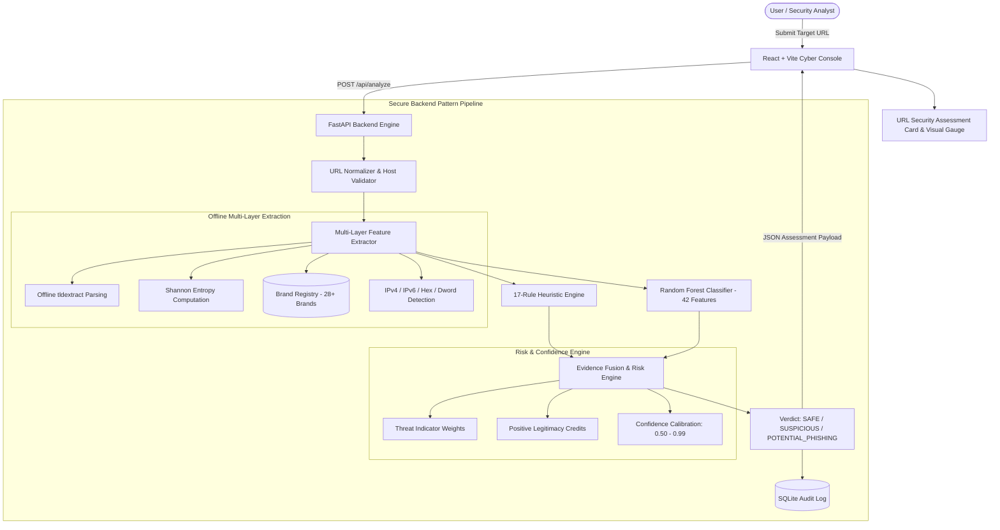

# Phishing URL Detection & Website Safety Checker

A professional, educational cybersecurity web application demonstrating multi-layered static URL pattern analysis, Shannon entropy calculation, brand impersonation detection, explainable heuristic threat scoring, and hybrid machine learning classification.

---

## Table of Contents

- [Overview](#overview)
- [Key Features](#key-features)
- [Core Cybersecurity Concepts](#core-cybersecurity-concepts)
  - [1. Why HTTPS Does Not Mean Safe](#1-why-https-does-not-mean-safe)
  - [2. Why Naive Keyword Matching Fails](#2-why-naive-keyword-matching-fails)
- [Architecture & Detection Pipeline](#architecture--detection-pipeline)
- [Multi-Layer Feature Extraction (42 Features)](#multi-layer-feature-extraction-42-features)
- [Rule Engine & Explainable Indicators (17 Rules)](#rule-engine--explainable-indicators-17-rules)
- [Scoring, Confidence & Evidence Fusion](#scoring-confidence--evidence-fusion)
- [Technology Stack](#technology-stack)
- [API Specification](#api-specification)
- [Installation & Running](#installation--running)
- [Automated Testing Suite (34 Tests)](#automated-testing-suite-34-tests)
- [Machine Learning Model Training](#machine-learning-model-training)
- [Security Considerations & SSRF Immunity](#security-considerations--ssrf-immunity)
- [Educational Limitations & Future Work](#educational-limitations--future-work)

---

## Overview

Phishing attacks remain the primary initial access vector across modern social engineering attacks. Naive detection systems often rely solely on static domain blocklists (which lag behind ephemeral attacks) or crude keyword checks that flag legitimate URLs like `https://github.com/login` as phishing.

The **Phishing URL Detection & Website Safety Checker** platform evaluates target URLs across mathematical, structural, lexical, and brand-impersonation dimensions using:
1. **Multi-layer Feature Extraction**: 42 static attributes including Shannon entropy, offline public suffix parsing (`tldextract`), IP encoding detection, and brand impersonation.
2. **Deterministic Rule Engine**: 17 modular rules with positive legitimacy credits (e.g. verified brand domain recognition).
3. **Machine Learning Classifier**: A scikit-learn Random Forest model trained on a balanced feature dataset.
4. **Calibrated Evidence Fusion**: Merges rule scores and ML probabilities into calibrated confidence scores (0.50 to 0.99) and explainable verdicts: `SAFE`, `SUSPICIOUS`, or `POTENTIAL_PHISHING`.

---

## Key Features

- **SSRF-Safe Static Analysis**: Zero outbound network requests from the backend server. Analysis operates exclusively on string-level patterns.
- **Brand Impersonation Intelligence**: Scans subdomains, paths, and userinfo authority prefixes against a registry of 28+ prominent brands (e.g., `paypal`, `google`, `microsoft`, `chase`, `apple`, `netflix`, `steam`, `binance`), flagging attempts like `http://paypal.com@attacker-site.org` or `http://login-apple-security.com`.
- **False-Positive Elimination**: Legitimate enterprise login portals (e.g., `https://github.com/login`, `https://accounts.google.com/`) are recognized as authorized brand domains, suppressing keyword penalties and granting positive legitimacy credits.
- **Multi-Type IP Host Detection**: Detects standard IPv4, raw IPv6, decimal/DWORD, octal, and hexadecimal encoded IP addresses.
- **Shannon Entropy Analysis**: Computes character entropy independently for hostname, domain, and path components to detect algorithmic domain generation (DGA) and randomized credential lures.
- **Explainable Indicators & UI Presentation**: Detailed indicators showing triggered name, severity, point contribution, technical finding, and security rationale.
- **Audit Logging & Telemetry**: SQLite-backed scan history, telemetry statistics, search, and category filtering.

---

## Core Cybersecurity Concepts

### 1. Why HTTPS Does Not Mean Safe

A pervasive myth among end users is that the browser padlock icon or `https://` protocol means a website is authentic and safe.

- **What HTTPS Guarantees**: TLS encryption in transit between the client browser and the web server. It prevents eavesdropping and tampering by intermediaries (such as attackers on public Wi-Fi).
- **What HTTPS Does NOT Guarantee**: The identity or intent of the website operator. Automated free certificate authorities (e.g., Let's Encrypt) issue TLS certificates to anyone within seconds, including phishing operators. Modern phishing kits operate almost entirely over HTTPS to mislead users into a false sense of security.

### 2. Why Naive Keyword Matching Fails

Early heuristic filters flag any URL containing words like `login`, `verify`, `account`, or `secure` as phishing. This creates severe false positives:
- Legitimate URLs such as `https://github.com/login`, `https://accounts.google.com/ServiceLogin`, and `https://login.microsoftonline.com/` naturally contain authentication keywords.
- Conversely, attackers often omit obvious keywords by using obfuscated paths, base64 fragments, or open redirect parameters (`?redirect=...`).

**Our Solution**: Contextual keyword evaluation. Keyword scores are only evaluated in conjunction with anomalous domain attributes (excessive subdomains, suspicious TLDs, high entropy). If the registered domain is an authorized brand domain, keyword penalties are suppressed and positive legitimacy credits are applied.

---

## Architecture & Detection Pipeline



---

## Multi-Layer Feature Extraction (42 Features)

The feature extractor (`backend/detection/feature_extractor.py`) computes 42 numerical and structural features without making any network requests:

| # | Feature Key | Description |
| :- | :--- | :--- |
| 1 | `url_length` | Total character count of full normalized URL |
| 2 | `domain_length` | Total character count of the domain (hostname) |
| 3 | `path_length` | Character count of the URL path |
| 4 | `query_length` | Character count of the query string |
| 5 | `dot_count` | Number of dot (`.`) characters |
| 6 | `hyphen_count` | Total hyphens in URL |
| 7 | `underscore_count` | Underscores in URL |
| 8 | `slash_count` | Forward slashes in URL |
| 9 | `digit_count` | Total numeric digits across URL |
| 10 | `special_character_count` | Non-alphanumeric characters excluding standard delimiters |
| 11 | `subdomain_count` | Number of subdomain hierarchy segments |
| 12 | `query_param_count` | Number of distinct query parameters |
| 13 | `path_depth` | Directory nesting depth |
| 14 | `has_https` | 1 if HTTPS, 0 otherwise |
| 15 | `has_http` | 1 if HTTP, 0 otherwise |
| 16 | `has_ip_address` | 1 if hostname is an IP address |
| 17 | `has_url_shortener` | 1 if hostname matches known URL shorteners |
| 18 | `has_at_symbol` | 1 if URL contains `@` credential spoofing |
| 19 | `has_double_slash_path` | 1 if path contains `//` evasion sequences |
| 20 | `has_punycode` | 1 if hostname contains `xn--` IDN homoglyphs |
| 21 | `has_percent_encoding` | 1 if percent-encoding (`%20`, `%2e`) is present |
| 22 | `percent_encoding_count` | Total count of `%XX` encoded sequences |
| 23 | `has_suspicious_tld` | 1 if TLD is in high-abuse set (`.xyz`, `.top`, `.tk`, etc.) |
| 24 | `has_suspicious_port` | 1 if custom non-standard port is specified |
| 25 | `custom_port` | Port number value or -1 if default |
| 26 | `has_long_hostname` | 1 if hostname exceeds 40 characters |
| 27 | `domain_hyphen_count` | Total hyphens within the domain |
| 28 | `is_hyphen_heavy_domain` | 1 if domain has 3 or more hyphens |
| 29 | `suspicious_keyword_count` | Total flagged contextual keywords |
| 30 | `has_login_keywords` | 1 if authentication lure keywords found |
| 31 | `has_account_keywords` | 1 if account update lure keywords found |
| 32 | `has_payment_keywords` | 1 if billing/banking keywords found |
| 33 | `has_urgency_keywords` | 1 if urgency lure keywords found |
| 34 | `entropy_hostname` | Shannon entropy of hostname string |
| 35 | `entropy_domain` | Shannon entropy of registered domain |
| 36 | `entropy_path` | Shannon entropy of path string |
| 37 | `has_brand_impersonation` | 1 if target mimics a brand without authorization |
| 38 | `is_authorized_brand` | 1 if domain is the legitimate registered brand host |
| 39 | `has_redirect_param` | 1 if query parameter contains open-redirect targets |
| 40 | `has_executable_ext` | 1 if path targets executable file (`.exe`, `.scr`, `.bat`) |
| 41 | `has_hex_ip` | 1 if IP is encoded in hexadecimal or decimal/DWORD format |
| 42 | `has_ipv6` | 1 if hostname is an IPv6 address |

---

## Rule Engine & Explainable Indicators (17 Rules)

The rule engine (`backend/detection/rules.py`) evaluates 17 modular rules:

| Rule Name | Severity | Max Weight | Description |
| :--- | :--- | :--- | :--- |
| **Brand Impersonation** | CRITICAL | +40 | Brand name appears in subdomain, userinfo, or path of an unauthorized domain. |
| **IP Address Hostname** | HIGH | +30 | Hostname is an IPv4, IPv6, hex, or decimal IP bypassing domain reputation. |
| **At Symbol Credential Spoof** | HIGH | +30 | URL contains `@`, causing browsers to discard prefix credentials. |
| **Punycode / IDN Homoglyph** | HIGH | +25 | Hostname uses internationalized `xn--` encoding to mimic brand characters. |
| **Executable Download** | HIGH | +25 | Path targets executable file extensions (`.exe`, `.scr`, `.bat`, `.cmd`, `.vbs`). |
| **Open Redirect Parameter** | MEDIUM | +20 | Query parameters contain embedded redirect URLs (`?redirect=...`). |
| **URL Shortener Service** | MEDIUM | +15 | Known shortening service obscuring final destination. |
| **Excessive Subdomains** | MEDIUM | +15 | 3 or more subdomain levels spoofing authentic infrastructure. |
| **Suspicious High-Abuse TLD** | MEDIUM | +15 | Domain uses low-cost, high-abuse TLDs (`.xyz`, `.top`, `.tk`, `.click`). |
| **High Domain Entropy** | MEDIUM | +15 | Registered domain Shannon entropy exceeds 4.0 (DGA/random string). |
| **Hyphen-Heavy Domain** | MEDIUM | +15 | Domain contains 3 or more hyphens commonly seen in typosquatting. |
| **Non-Standard Port** | MEDIUM | +15 | Non-standard port (e.g. 8080, 8888, 3128) bypassing standard filters. |
| **Contextual Keywords** | MEDIUM | +15 | Authentication, financial, or urgency lures on unverified domains. |
| **Double Slash Path** | MEDIUM | +10 | Path contains `//` sequence used to confuse naive URL parsers. |
| **Unencrypted HTTP Protocol** | LOW | +10 | Plaintext HTTP lacking TLS encryption. |
| **Abnormally Long URL** | LOW | +10 | URL exceeds 75 characters to hide query payloads. |
| **Percent-Encoding Obfuscation** | LOW | +10 | Multiple hex percent-encoded characters masking sensitive strings. |

---

## Scoring, Confidence & Evidence Fusion

### Verdict Thresholds
- **SAFE**: Normalized Score **0 – 29**
- **SUSPICIOUS**: Normalized Score **30 – 59**
- **POTENTIAL_PHISHING**: Normalized Score **60 – 100**

### Positive Legitimacy Credits
- **Authorized Brand Registry Match**: **-20 pts** (e.g. `github.com`, `google.com`, `microsoft.com`)
- **Clean Profile Baseline**: **-5 pts** (HTTPS, standard ports, no IP, zero threat indicators)

### Calibrated Confidence Formulation
Confidence ranges strictly between `0.50` and `0.99`:
$$\text{confidence} = 0.50 + 0.35 \times \frac{|\text{score} - 45|}{55} + 0.14 \times \min(N_{\text{indicators}}, 3) / 3$$

---

## Technology Stack

- **Backend**: Python 3.10+ / 3.13, FastAPI, Uvicorn, Scikit-learn, Joblib, `tldextract` (offline mode), Pydantic v2, SQLite3.
- **Frontend**: React 19, TypeScript, Vite 8, Tailwind CSS v4, Lucide React, Framer Motion.
- **Testing**: Pytest, HTTPX, FastAPI TestClient.

---

## API Specification

### `POST /api/analyze`
Submits a URL string for multi-layer static threat analysis.

**Request**:
```json
{
  "url": "http://paypal.com@account-verify.xyz/update"
}
```

**Response**:
```json
{
  "original_url": "http://paypal.com@account-verify.xyz/update",
  "normalized_url": "http://paypal.com@account-verify.xyz/update",
  "url": "http://paypal.com@account-verify.xyz/update",
  "classification": "POTENTIAL_PHISHING",
  "risk_score": 85,
  "confidence": 0.94,
  "risk_level": "CRITICAL",
  "detection_method": "Hybrid Rule + ML Analysis",
  "indicator_count": 4,
  "indicators": [
    {
      "rule_id": "brand_impersonation",
      "name": "Brand Impersonation Detected",
      "severity": "CRITICAL",
      "score": 40,
      "description": "Legitimate brands host services on their verified registered domain...",
      "detail": "URL appears to impersonate 'paypal' on unauthorized domain 'account-verify.xyz'."
    },
    {
      "rule_id": "at_symbol",
      "name": "@ Symbol in URL Authority",
      "severity": "HIGH",
      "score": 30,
      "description": "Browsers treat text before @ as credentials and discard it...",
      "detail": "URL contains '@' symbol, which obscures the actual destination host."
    }
  ],
  "legitimacy_credits": 0,
  "recommendations": [
    "Potential Phishing Alert: Multiple critical threat indicators identified...",
    "Do not input credentials, passwords, or payment information..."
  ],
  "features": { ... },
  "domain_analysis": { ... },
  "ml_metadata": {
    "detection_method": "Hybrid Rule + ML Analysis",
    "ml_available": true,
    "ml_phishing_probability": 0.98,
    "ml_prediction": "PHISHING",
    "hybrid_confidence": "98.0%",
    "model_type": "RandomForestClassifier",
    "features_used": 42
  },
  "processing_time_ms": 2.45,
  "timestamp": "2026-09-27T03:45:00Z",
  "disclaimer": "Pattern-based detection cannot guarantee that a website is safe or malicious..."
}
```

### Other Endpoints
- `GET /api/history`: Paginated scan audit trail with query and classification filters.
- `GET /api/history/{id}`: Detailed inspection record by scan ID.
- `DELETE /api/history/{id}`: Removes an individual scan record.
- `DELETE /api/history`: Clears all scan history.
- `GET /api/statistics`: Real-time scan telemetry and indicator frequency.
- `GET /api/rules`: Lists active detection rules, weights, and descriptions.
- `GET /api/health`: Service health and ML model status.

---

## Installation & Running

### 1. Backend
```bash
cd backend
python -m venv venv

# Windows (PowerShell):
.\venv\Scripts\Activate.ps1
# Linux / macOS:
source venv/bin/activate

pip install -r requirements.txt
python train_model.py
uvicorn main:app --reload --port 8000
```
Backend runs at `http://127.0.0.1:8000` (Swagger docs: `http://127.0.0.1:8000/docs`).

### 2. Frontend
```bash
cd frontend
npm install
npm run dev
```
Frontend runs at `http://127.0.0.1:5173`.

---

## Automated Testing Suite (34 Tests)

Run the full automated test suite:
```bash
.\backend\venv\Scripts\pytest backend\tests -v
```

The 34 unit and integration tests include:
- **20 Legitimate URLs**: Verified against `SAFE` verdict with zero false positives (including `https://github.com/login`, `https://accounts.google.com/`, `https://login.microsoftonline.com/`).
- **20 Suspicious URLs**: Evaluated against `SUSPICIOUS` verdict (shorteners, unencrypted HTTP with non-standard ports, deep directories).
- **20 Synthetic Phishing URLs**: Verified against `POTENTIAL_PHISHING` verdict (raw IPs, brand impersonation, `@` spoofing, Punycode, high-risk TLDs).
- **Rule Engine & Classifier Isolation**: Testing all 17 rules, 42-feature dimension consistency, and API endpoint integration.

---

## Machine Learning Model Training

The pipeline in `backend/train_model.py`:
1. Loads balanced samples from `backend/dataset/urls.csv`.
2. Extracts 42-dimensional numerical feature vectors.
3. Fits a `RandomForestClassifier` with balanced class weights.
4. Serializes the artifact to `backend/models/phishing_model.joblib`.

---

## Security Considerations & SSRF Immunity

1. **Zero Outbound HTTP Requests**: All checks are static/lexical. The server never connects to submitted URLs, eliminating Server-Side Request Forgery (SSRF) vulnerabilities.
2. **Safe Logging**: The server logs only hostnames and metrics. Query parameters, passwords, and tokens are never written to server logs.
3. **Strict Validation**: URLs exceeding 2,048 characters or containing illegal control characters are rejected immediately.

---

## Educational Limitations & Future Work

- **Static Analysis Scope**: Phishing kits hosted on legitimate platforms (e.g. compromised Google Drive links or SharePoint documents) have clean URLs and require external threat intelligence feeds for detection.
- **Future Additions**: Safe Browsing API integration, WHOIS domain age queries, passive DNS nameserver infrastructure analysis, and QR code image decoding.
